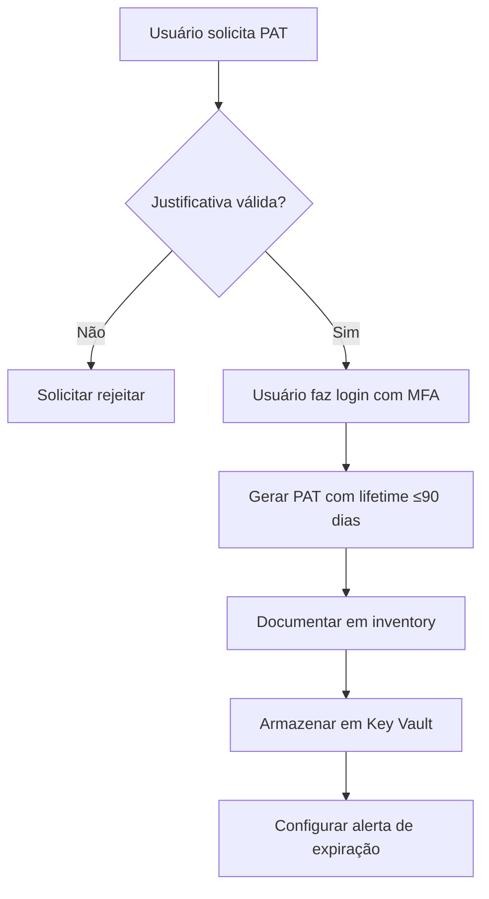

# Governança de Personal Access Tokens (PATs) - Azure Databricks

## Visão Geral

Personal Access Tokens (PATs) são credenciais de longa duração que permitem autenticação programática no Azure Databricks. Embora convenientes, PATs representam um risco de segurança se não gerenciados adequadamente. Este documento estabelece práticas de governança para PATs.

---

## 1. Riscos Associados a PATs

### 1.1 Ameaças de Segurança

| Risco | Impacto | Probabilidade |
|-------|---------|---------------|
| **Exposição em código-fonte** | Alto | Médio |
| **Token comprometido** | Alto | Baixo |
| **Uso excessivo de permissões** | Médio | Alto |
| **Tokens órfãos (sem owner)** | Médio | Alto |
| **Tokens sem expiração** | Alto | Médio |
| **Compartilhamento de tokens** | Alto | Baixo |
| **Tokens em logs** | Médio | Médio |

### 1.2 Cenários de Comprometimento

```
Cenário 1: Token no GitHub
User commits notebook com PAT → Public repo → Token exposto → Acesso não autorizado

Cenário 2: Token em CI/CD
PAT em variável de ambiente não segura → Build log público → Token vazado

Cenário 3: Token compartilhado
User compartilha PAT com colega → Colega sai da empresa → Token permanece ativo

Cenário 4: Token sem MFA prévio
Usuário cria PAT sem fazer login com MFA → Bypass da política de MFA
```

---

## 2. Políticas de PAT

### 2.1 Política de Criação

#### Requisitos Obrigatórios

- [ ] **Login com MFA**: Usuário deve fazer login interativo com MFA antes de gerar PAT
- [ ] **Tempo máximo de vida**: PATs não devem exceder 90 dias
- [ ] **Justificativa de negócio**: Documentar motivo para criação do PAT
- [ ] **Escopo mínimo**: PAT deve ter apenas permissões necessárias
- [ ] **Naming convention**: PATs devem seguir padrão de nomenclatura

#### Configuração no Databricks

```python
# Workspace Settings > Access Control
{
    "token_management": {
        "max_lifetime_days": 90,
        "enable_comments": true,
        "enable_on_cluster": false
    }
}
```

#### PowerShell para configurar

```powershell
# Configurar limite de lifetime via API
$headers = @{
    "Authorization" = "Bearer $adminToken"
    "Content-Type" = "application/json"
}

$body = @{
    "max_token_lifetime_days" = 90
} | ConvertTo-Json

Invoke-RestMethod `
    -Uri "https://$workspaceUrl/api/2.0/workspace-conf" `
    -Method PATCH `
    -Headers $headers `
    -Body $body
```

### 2.2 Política de Nomenclatura

**Padrão:**
```
[AMBIENTE]-[PROPÓSITO]-[OWNER]-[DATA]
```

**Exemplos:**
- `PROD-CICD-DataEng-2024-11`
- `DEV-Automation-JohnDoe-2024-11`
- `PROD-Monitoring-AlertSystem-2024-11`

**Vantagens:**
- Fácil identificação do propósito
- Rastreabilidade ao dono
- Facilita auditoria

### 2.3 Política de Armazenamento

#### ✅ Práticas Recomendadas

1. **Azure Key Vault** (preferido)
   ```bash
   # Armazenar PAT no Key Vault
   az keyvault secret set \
       --vault-name myKeyVault \
       --name databricks-pat-prod \
       --value "dapi1234567890abcdef"
   ```

2. **GitHub Secrets** (para CI/CD)
   ```yaml
   # .github/workflows/databricks-deploy.yml
   env:
     DATABRICKS_TOKEN: ${{ secrets.DATABRICKS_TOKEN }}
   ```

3. **Azure DevOps Variable Groups**
   ```
   Variable Groups > New variable group
   Name: Databricks-Tokens
   Variables:
     - DATABRICKS_PAT (secret, locked)
   ```

4. **Environment Variables** (local dev apenas)
   ```bash
   # .env (NUNCA commitar este arquivo!)
   DATABRICKS_TOKEN=dapi1234567890abcdef
   
   # .gitignore
   .env
   ```

#### ❌ Práticas Proibidas

- ❌ Hardcode em código-fonte
- ❌ Commit em repositórios Git
- ❌ Armazenar em plain text files
- ❌ Compartilhar via email/chat
- ❌ Armazenar em wikis/documentação
- ❌ Incluir em logs de aplicação

---

## 3. Processo de Gestão de PAT

### 3.1 Criação de PAT

**Workflow aprovado:**



**Script de criação com auditoria:**

```python
# create_pat.py
import requests
import json
from datetime import datetime, timedelta

def create_databricks_pat(
    workspace_url,
    admin_token,
    comment,
    lifetime_days=90,
    owner_email=None
):
    """
    Cria PAT com auditoria
    """
    
    # Validar lifetime
    if lifetime_days > 90:
        raise ValueError("Lifetime não pode exceder 90 dias")
    
    # Calcular expiração
    expiry_time = int((datetime.now() + timedelta(days=lifetime_days)).timestamp() * 1000)
    
    # Criar PAT
    headers = {
        "Authorization": f"Bearer {admin_token}",
        "Content-Type": "application/json"
    }
    
    body = {
        "lifetime_seconds": lifetime_days * 86400,
        "comment": f"{comment} | Owner: {owner_email} | Created: {datetime.now().isoformat()}"
    }
    
    response = requests.post(
        f"https://{workspace_url}/api/2.0/token/create",
        headers=headers,
        json=body
    )
    
    if response.status_code == 200:
        token_info = response.json()
        
        # Registrar em auditoria
        audit_entry = {
            "token_id": token_info.get("token_info", {}).get("token_id"),
            "owner": owner_email,
            "created_date": datetime.now().isoformat(),
            "expiry_date": datetime.fromtimestamp(expiry_time/1000).isoformat(),
            "comment": comment,
            "lifetime_days": lifetime_days
        }
        
        # Salvar em arquivo de auditoria
        with open("pat_inventory.json", "a") as f:
            f.write(json.dumps(audit_entry) + "\n")
        
        print(f"✅ PAT criado com sucesso!")
        print(f"   Token ID: {audit_entry['token_id']}")
        print(f"   Expira em: {audit_entry['expiry_date']}")
        print(f"   ⚠️ ARMAZENE O TOKEN EM LOCAL SEGURO!")
        
        return token_info["token_value"]
    else:
        raise Exception(f"Erro ao criar PAT: {response.text}")

# Uso
token = create_databricks_pat(
    workspace_url="myworkspace.databricks.azure.com",
    admin_token="dapi-admin-token",
    comment="PROD-CICD-DataEng",
    lifetime_days=90,
    owner_email="dataeng@contoso.com"
)
```

### 3.2 Rotação de PATs

**Frequência recomendada:** A cada 90 dias ou menos

**Processo de rotação:**

1. **30 dias antes da expiração:**
   - Enviar alerta ao owner
   - Solicitar justificativa para renovação

2. **15 dias antes da expiração:**
   - Segundo alerta
   - Escalar se sem resposta

3. **7 dias antes da expiração:**
   - Criar novo PAT
   - Testar em ambiente não-produção
   - Atualizar em Key Vault

4. **No dia da expiração:**
   - Ativar novo PAT em produção
   - Verificar funcionamento
   - Documentar rotação

**Script de rotação:**

```powershell
# Rotate-DatabricksPAT.ps1

param(
    [string]$WorkspaceUrl,
    [string]$AdminToken,
    [string]$TokenId,
    [int]$NewLifetimeDays = 90
)

# 1. Obter info do token atual
$headers = @{
    "Authorization" = "Bearer $AdminToken"
}

$currentToken = Invoke-RestMethod `
    -Uri "https://$WorkspaceUrl/api/2.0/token/list" `
    -Headers $headers |
    Select-Object -ExpandProperty token_infos |
    Where-Object { $_.token_id -eq $TokenId }

if (-not $currentToken) {
    Write-Error "Token $TokenId não encontrado"
    exit 1
}

Write-Host "🔄 Rotacionando PAT..." -ForegroundColor Cyan
Write-Host "   Token ID atual: $TokenId" -ForegroundColor Gray
Write-Host "   Comment: $($currentToken.comment)" -ForegroundColor Gray

# 2. Criar novo token
$newTokenBody = @{
    lifetime_seconds = $NewLifetimeDays * 86400
    comment = "$($currentToken.comment) | Rotated: $(Get-Date -Format 'yyyy-MM-dd')"
} | ConvertTo-Json

$newToken = Invoke-RestMethod `
    -Uri "https://$WorkspaceUrl/api/2.0/token/create" `
    -Method Post `
    -Headers $headers `
    -Body $newTokenBody `
    -ContentType "application/json"

Write-Host "✅ Novo PAT criado" -ForegroundColor Green
Write-Host "   Novo Token ID: $($newToken.token_info.token_id)" -ForegroundColor Gray

# 3. Atualizar Key Vault (se aplicável)
$vaultName = "myKeyVault"
$secretName = "databricks-pat-prod"

az keyvault secret set `
    --vault-name $vaultName `
    --name $secretName `
    --value $newToken.token_value

Write-Host "✅ Key Vault atualizado" -ForegroundColor Green

# 4. Testar novo token
$testHeaders = @{
    "Authorization" = "Bearer $($newToken.token_value)"
}

try {
    Invoke-RestMethod `
        -Uri "https://$WorkspaceUrl/api/2.0/clusters/list" `
        -Headers $testHeaders | Out-Null
    Write-Host "✅ Novo token testado com sucesso" -ForegroundColor Green
}
catch {
    Write-Error "❌ Falha ao testar novo token: $_"
    exit 1
}

# 5. Revogar token antigo
$revokeBody = @{
    token_id = $TokenId
} | ConvertTo-Json

Invoke-RestMethod `
    -Uri "https://$WorkspaceUrl/api/2.0/token/delete" `
    -Method Post `
    -Headers $headers `
    -Body $revokeBody `
    -ContentType "application/json"

Write-Host "✅ Token antigo revogado" -ForegroundColor Green
Write-Host ""
Write-Host "🎉 Rotação concluída com sucesso!" -ForegroundColor Cyan
```

### 3.3 Auditoria de PATs

**Frequência:** Mensal

**Script de auditoria:**

```powershell
# Audit-DatabricksPATs.ps1

param(
    [string]$WorkspaceUrl,
    [string]$AdminToken
)

$headers = @{
    "Authorization" = "Bearer $AdminToken"
}

# Listar todos os tokens
$tokens = Invoke-RestMethod `
    -Uri "https://$WorkspaceUrl/api/2.0/token/list" `
    -Headers $headers

Write-Host "📊 Auditoria de PATs - $(Get-Date -Format 'yyyy-MM-dd')" -ForegroundColor Cyan
Write-Host "=" * 70
Write-Host ""

# Estatísticas gerais
$totalTokens = $tokens.token_infos.Count
$now = [DateTimeOffset]::UtcNow.ToUnixTimeMilliseconds()

$expiringSoon = $tokens.token_infos | Where-Object {
    $_.expiry_time -and 
    (($_.expiry_time - $now) / (86400000)) -lt 30
}

$expired = $tokens.token_infos | Where-Object {
    $_.expiry_time -and $_.expiry_time -lt $now
}

Write-Host "Total de PATs: $totalTokens" -ForegroundColor White
Write-Host "Expirando em <30 dias: $($expiringSoon.Count)" -ForegroundColor Yellow
Write-Host "Expirados: $($expired.Count)" -ForegroundColor Red
Write-Host ""

# Listar tokens expirando
if ($expiringSoon.Count -gt 0) {
    Write-Host "⚠️ PATs expirando em breve:" -ForegroundColor Yellow
    foreach ($token in $expiringSoon) {
        $daysLeft = [math]::Floor(($token.expiry_time - $now) / 86400000)
        Write-Host "   • $($token.comment)" -ForegroundColor White
        Write-Host "     Token ID: $($token.token_id)" -ForegroundColor Gray
        Write-Host "     Dias restantes: $daysLeft" -ForegroundColor Gray
        Write-Host ""
    }
}

# Identificar tokens órfãos (sem comment ou info de owner)
$orphanTokens = $tokens.token_infos | Where-Object {
    -not $_.comment -or $_.comment -notmatch "Owner:"
}

if ($orphanTokens.Count -gt 0) {
    Write-Host "🚨 PATs órfãos (sem owner identificado):" -ForegroundColor Red
    foreach ($token in $orphanTokens) {
        Write-Host "   • Token ID: $($token.token_id)" -ForegroundColor White
        Write-Host "     Created: $($token.creation_time)" -ForegroundColor Gray
        Write-Host ""
    }
}

# Exportar para CSV
$report = $tokens.token_infos | ForEach-Object {
    $daysToExpiry = if ($_.expiry_time) {
        [math]::Floor(($_.expiry_time - $now) / 86400000)
    } else {
        "Nunca expira"
    }
    
    [PSCustomObject]@{
        TokenId = $_.token_id
        Comment = $_.comment
        CreatedBy = $_.created_by_username
        CreationTime = [DateTimeOffset]::FromUnixTimeMilliseconds($_.creation_time).ToString("yyyy-MM-dd")
        ExpiryTime = if ($_.expiry_time) {
            [DateTimeOffset]::FromUnixTimeMilliseconds($_.expiry_time).ToString("yyyy-MM-dd")
        } else {
            "N/A"
        }
        DaysToExpiry = $daysToExpiry
        Status = if ($_.expiry_time -lt $now) { "Expirado" }
                 elseif ($daysToExpiry -lt 30) { "Expirando em breve" }
                 else { "Ativo" }
    }
}

$reportPath = "pat-audit-report-$(Get-Date -Format 'yyyy-MM-dd').csv"
$report | Export-Csv -Path $reportPath -NoTypeInformation

Write-Host "✅ Relatório exportado para: $reportPath" -ForegroundColor Green
```

### 3.4 Revogação de PATs

**Cenários de revogação imediata:**

1. **Suspeita de comprometimento**
2. **Funcionário sai da empresa**
3. **Token exposto em código-fonte**
4. **Violação de política de uso**

**Script de revogação:**

```bash
#!/bin/bash
# revoke-pat.sh

WORKSPACE_URL="$1"
ADMIN_TOKEN="$2"
TOKEN_ID="$3"
REASON="$4"

echo "🚨 Revogando PAT..."
echo "   Token ID: $TOKEN_ID"
echo "   Motivo: $REASON"

# Revogar token
curl -X POST \
  "https://$WORKSPACE_URL/api/2.0/token/delete" \
  -H "Authorization: Bearer $ADMIN_TOKEN" \
  -H "Content-Type: application/json" \
  -d "{\"token_id\": \"$TOKEN_ID\"}"

# Registrar em auditoria
echo "$(date -Iseconds) | Revoked | $TOKEN_ID | $REASON" >> pat-revocation-log.txt

echo "✅ PAT revogado com sucesso"
```

---

## 4. Alternativas a PATs

### 4.1 Azure Managed Identities (Preferido)

**Vantagens:**
- Sem necessidade de gerenciar credenciais
- Rotação automática
- Integração nativa com Azure

**Exemplo:**

```python
from azure.identity import DefaultAzureCredential
from databricks.sdk import WorkspaceClient

# Usar managed identity
credential = DefaultAzureCredential()
w = WorkspaceClient(
    host="https://myworkspace.databricks.azure.com",
    azure_workspace_resource_id="/subscriptions/.../workspaces/myworkspace",
    azure_use_azure_cli_auth=True
)

# Listar clusters
clusters = w.clusters.list()
```

### 4.2 OAuth 2.0 Tokens

**Para aplicações web:**

```python
# Usar OAuth 2.0 flow
# Tokens de curta duração (1 hora)
# Refresh tokens gerenciados automaticamente
```

### 4.3 Service Principals

**Para automação:**

```bash
# Criar service principal
az ad sp create-for-rbac --name databricks-automation

# Configurar no Databricks
databricks secrets put --scope prod --key sp-client-id
databricks secrets put --scope prod --key sp-client-secret
```

---

## 5. Monitoramento e Alertas

### 5.1 Métricas de Governança

| Métrica | Meta | Atual |
|---------|------|-------|
| PATs com lifetime > 90 dias | 0 | __ |
| PATs órfãos (sem owner) | 0 | __ |
| PATs expirados não revogados | 0 | __ |
| Tempo médio de rotação | <90 dias | __ |
| % PATs em Key Vault | 100% | __ |

### 5.2 Alertas Configurados

- [ ] Alerta: PAT expirando em 30 dias
- [ ] Alerta: PAT expirado não revogado
- [ ] Alerta: Novo PAT criado sem comment
- [ ] Alerta: PAT usado de localização anômala
- [ ] Alerta: Alto volume de requests com mesmo PAT

---

## 6. Compliance e Auditoria

### 6.1 Evidências para Auditoria

Manter documentação de:
- [ ] Inventário completo de PATs
- [ ] Log de criação de PATs
- [ ] Log de rotação de PATs
- [ ] Log de revogação de PATs
- [ ] Justificativas de negócio
- [ ] Relatórios de auditoria mensal

### 6.2 Controles de Compliance

| Framework | Controle | Status |
|-----------|----------|--------|
| ISO 27001 | A.9.2.1 - User registration | ☐ |
| ISO 27001 | A.9.2.2 - User access provisioning | ☐ |
| ISO 27001 | A.9.4.3 - Password management | ☐ |
| SOC 2 | CC6.1 - Logical access | ☐ |
| NIST | IA-5 - Authenticator management | ☐ |

---

## Referências

- [Databricks Token Management](https://docs.databricks.com/dev-tools/auth.html#personal-access-tokens)
- [Azure Key Vault Best Practices](https://docs.microsoft.com/azure/key-vault/general/best-practices)
- [NIST Digital Identity Guidelines](https://pages.nist.gov/800-63-3/)

---

**Versão:** 1.0  
**Última atualização:** 2025-11-06  
**Owner:** Security Team  
**Próxima revisão:** _______
